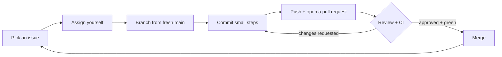

# Git and GitHub: a working guide

How to do the everyday things: take a task, work on it, get it reviewed,
review someone else's. Commands for the terminal, and where to click on GitHub.
The rules behind them (commit messages, what goes in one pull request) are in
[conventions.md](conventions.md).

## 1. The daily loop



## 2. Finding and taking a task

### Where the tasks are

| What you want                     | Where                                                                |
| --------------------------------- | -------------------------------------------------------------------- |
| Everything open in this milestone | **Issues** tab → _Milestones_ → the current one                      |
| Nobody is working on it yet       | Issues search: `is:open no:assignee milestone:"M1: The bot answers"` |
| Easy ones to start with           | `is:open no:assignee label:"good first issue"`                       |
| Your track                        | `is:open label:"track: data"` (or your track's label)                |
| What you have taken               | `is:open assignee:@me`                                               |
| How far the milestone is          | **Issues** → _Milestones_: a progress bar and the due date           |

Type the search into the box above the issue list, then bookmark the page:
it becomes your personal view.

### Taking one

1. Open the issue and read it to the end, including **Blocked by #…**. If a
   blocker is still open, pick something else.
2. In the right sidebar, **Assignees** → _assign yourself_.
3. Comment `Taking this` and, if it helps, one line on how you plan to do it.
4. At most **two** issues assigned at a time. Stuck for a day? Unassign
   yourself, comment where you stopped, and say so on Discord.

From the terminal (with `gh`):

```bash
gh issue list --milestone "M1: The bot answers" --search "no:assignee"
gh issue view 12                     # read it
gh issue edit 12 --add-assignee @me  # take it
gh issue comment 12 --body "Taking this"
```

## 3. Working on it

```bash
git switch main && git pull                  # always start from fresh main
git switch -c feat/12-verify-signature       # prefix/issue-number-short-name

# … work …
git status                                   # what changed
git diff                                     # how it changed
git add -p                                   # stage piece by piece and read every hunk
git commit                                   # the editor opens: subject, blank line, why
git push -u origin HEAD                      # first push of this branch
```

- **`git add -p`, not `git add .`.** You see every change before it goes in,
  so a `.env`, a debug `console.log` or a stray file never slips through.
- Commit whenever one small step works. Push at least once a day, so your work
  is not only on your laptop.

### Keeping your branch up to date

When `main` moved on while you were working:

```bash
git fetch
git rebase origin/main        # replay your commits on top of the new main
# conflict? fix the files, then:
git add <file> && git rebase --continue
git push --force-with-lease   # only on YOUR branch, never on main
```

`--force-with-lease` refuses to overwrite commits someone else pushed to your
branch in the meantime. Never use a plain `--force`.

### Getting out of trouble

| Situation                                             | Command                                                                |
| ----------------------------------------------------- | ---------------------------------------------------------------------- |
| Throw away changes in one file                        | `git restore <file>`                                                   |
| Unstage a file (keep the changes)                     | `git restore --staged <file>`                                          |
| Undo the last commit, keep its changes                | `git reset --soft HEAD~1` (not pushed yet!)                            |
| Fix the last commit's message or add a forgotten file | `git commit --amend` (not pushed yet!)                                 |
| Undo a commit that is already pushed or merged        | `git revert <sha>`: a new commit that reverses it                      |
| Put work aside to switch branches                     | `git stash`, later `git stash pop`                                     |
| See the history as a tree                             | `git log --oneline --graph --all`                                      |
| Committed a secret                                    | **Stop. Tell your mentor now.** Do not try to rewrite history yourself |

Rule of thumb: rewriting history (`reset`, `amend`, `rebase`) is fine for
commits that exist **only on your laptop or your own branch**. Once they are on
`main`, use `revert`.

## 4. Opening a pull request

```bash
gh pr create --fill --assignee @me    # or the "Compare & pull request" button on GitHub
```

- **Title:** a commit subject (`feat(report): save the report on submit`).
- **Description:** the template's three questions. `Closes #12` links the
  issue, which then closes itself on merge.
- **Reviewers** (right sidebar): your teammate first. The code owner is added
  automatically.
- **Draft pull request:** open it early as a _draft_ if you want feedback
  before it is finished. Mark it _Ready for review_ when it is done.

### Reading a pull request page

| Tab               | What it shows                                                       |
| ----------------- | ------------------------------------------------------------------- |
| **Conversation**  | description, comments, review verdicts, the merge box at the bottom |
| **Commits**       | the commits, one by one: check they tell a story                    |
| **Checks**        | CI. Red? Click _Details_ → the failing step → the log               |
| **Files changed** | the diff. This is where review happens                              |

The merge box tells you exactly what is still missing: an approval, a green
check, unresolved conversations.

## 5. Reviewing your teammate's pull request

Find what waits for you: **Pull requests** tab →
`is:open review-requested:@me`, or `gh pr list --search "review-requested:@me"`.

1. **Files changed** → read the whole diff once before commenting.
2. Click the **+** next to a line to comment on it. Use **Start a review**, not
   _Add single comment_, so your comments arrive together.
3. To propose a concrete change, use the _suggestion_ button (or a
   ` ```suggestion ` block). The author applies it with one click.
4. Pull the branch and run it if the change is not obvious from the diff:
   `gh pr checkout 14`, then `pnpm dev`.
5. **Finish your review** → choose:
   - **Comment**: questions, nothing blocking;
   - **Approve**: you would be fine maintaining this code;
   - **Request changes**: something must change before merge, and you said
     what.

What to look for, in this order: does it do what the issue asks · is it
tested · will the next person understand it · naming and small things.
Be specific and kind: comment on the code, not the person. "This breaks when
`hours` is empty, see line 12" helps; "this is wrong" does not.

### When you are the author

- Answer **every** comment: a change, or a reason why not.
- Push fixes as **new commits** during review, so the reviewer sees only what
  changed since they last looked.
- Let the reviewer resolve their own conversations.
- After the last change, click **Re-request review** (the circular arrow next
  to their name).

## 6. Other places worth knowing

| Place                                                        | What for                                                      |
| ------------------------------------------------------------ | ------------------------------------------------------------- |
| [github.com/notifications](https://github.com/notifications) | everything that mentions you or waits for you. Check it daily |
| **Watch** button on the repository → _Custom_                | choose to be notified about issues, pull requests, releases   |
| **Actions** tab                                              | every CI run, with logs                                       |
| **Insights → Contributors / Pulse**                          | what happened in the repository this week                     |
| Press `?` anywhere on GitHub                                 | keyboard shortcuts (`t` finds a file, `.` opens the editor)   |
| Press `/` on any page                                        | search                                                        |

## 7. What protects `main`

`main` only changes through a pull request, and the pull request can only be
merged when:

- CI (`Lint, typecheck, test, build`) is green, on a branch up to date with
  `main`;
- it has an approving review (from a code owner, where the repository has
  `CODEOWNERS`), given **after** the last push;
- every review conversation is resolved.

Force-pushing to `main` and deleting it are blocked. You cannot get around
this, and you do not need to: if the merge box says something is missing, that
is the next thing to do.
