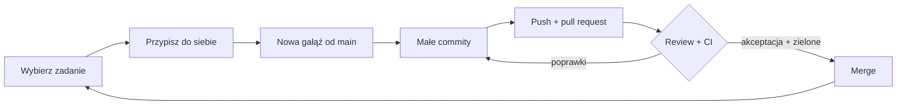

# Git i GitHub w praktyce

Jak robić codzienne rzeczy: wziąć zadanie, pracować nad nim, oddać je do
sprawdzenia i sprawdzić zadanie kolegi. Są tu polecenia do terminala i opis,
gdzie kliknąć na GitHubie. Zasady (jak pisać commity, co wkłada się do jednego
pull requesta) są w [conventions.md](conventions.md).

## 1. Codzienny cykl pracy



## 2. Jak znaleźć i wziąć zadanie

### Gdzie są zadania

Wejdź w zakładkę **Issues**. W polu wyszukiwania nad listą możesz wpisać
filtr. Gotowe filtry:

| Chcesz zobaczyć…                        | Wpisz w wyszukiwarkę Issues                    |
| --------------------------------------- | ---------------------------------------------- |
| zadania, których nikt jeszcze nie wziął | `is:open no:assignee`                          |
| zadania ćwiczeniowe                     | `is:open no:assignee label:practice`           |
| łatwe zadania na start                  | `is:open no:assignee label:"good first issue"` |
| zadania, które wziąłeś                  | `is:open assignee:@me`                         |
| zadania z danego etapu (milestone)      | **Issues** → **Milestones** → kliknij etap     |

**Wskazówka:** gdy wpiszesz filtr, dodaj stronę do zakładek w przeglądarce.
Będziesz mieć swój widok zadań pod jednym kliknięciem.

### Jak wziąć zadanie

1. Otwórz zadanie i **przeczytaj je do końca**. Jeśli jest tam linijka
   **Blocked by #…**, a tamto zadanie jest jeszcze otwarte, wybierz inne.
2. Po prawej: **Assignees** → **assign yourself**.
3. Napisz komentarz `Biorę to` (albo `Taking this`).
4. Miej **najwyżej dwa** zadania naraz. Utknąłeś na cały dzień? Odepnij się z
   zadania (kliknij swoje zdjęcie przy **Assignees**), napisz w komentarzu, gdzie
   skończyłeś, i daj znać na Discordzie.

To samo z terminala (program `gh`):

```bash
gh issue list --search "no:assignee"      # zadania bez nikogo
gh issue view 12                          # przeczytaj zadanie nr 12
gh issue edit 12 --add-assignee @me       # weź zadanie nr 12
```

## 3. Praca nad zadaniem

```bash
git switch main
git pull                                  # zawsze zaczynaj od najnowszego main
git switch -c feat/12-krotki-opis         # nowa gałąź: rodzaj/numer-zadania-opis
```

Rodzaje gałęzi:

| Początek nazwy | Kiedy              |
| -------------- | ------------------ |
| `feat/`        | coś nowego         |
| `fix/`         | naprawa błędu      |
| `docs/`        | tylko dokumentacja |
| `test/`        | tylko testy        |

Potem pracujesz i zapisujesz zmiany:

```bash
git status                                # co się zmieniło
git diff                                  # jak się zmieniło (wyjście: klawisz q)
git add -p                                # wybierz zmiany: y = tak, n = nie
git commit -m "feat(home): show the date"   # zapisz z opisem po angielsku
git push -u origin HEAD                   # wyślij na GitHuba (za pierwszym razem)
git push                                  # kolejne razy wystarczy tak
```

- **Używaj `git add -p`, a nie `git add .`** Widzisz każdą zmianę, zanim ją
  zapiszesz, więc przypadkiem nie wyślesz pliku `.env` ani `console.log`
  zostawionego do testów.
- Rób commit za każdym razem, gdy mały krok działa. **Wysyłaj (push)
  przynajmniej raz dziennie**, żeby Twoja praca nie była tylko na laptopie.

### Gdy `main` zmienił się w trakcie Twojej pracy

Ktoś dołączył swoją zmianę, a Ty chcesz mieć ją u siebie:

```bash
git fetch
git rebase origin/main
```

Jeśli pojawi się konflikt: popraw pliki (jak w kroku 12
[pierwszego pull requesta](first-pull-request.md)), potem:

```bash
git add <plik>
git rebase --continue
git push --force-with-lease               # TYLKO na swojej gałęzi, nigdy na main
```

### Gdy coś pójdzie nie tak

| Sytuacja                                                  | Polecenie                                               |
| --------------------------------------------------------- | ------------------------------------------------------- |
| chcę cofnąć zmiany w pliku (jeszcze bez commita)          | `git restore <plik>`                                    |
| dodałem plik przez `git add`, a nie chciałem              | `git restore --staged <plik>`                           |
| chcę cofnąć ostatni commit, ale zostawić zmiany w plikach | `git reset --soft HEAD~1` (tylko przed push!)           |
| literówka w opisie ostatniego commita                     | `git commit --amend -m "nowy opis"` (tylko przed push!) |
| chcę na chwilę odłożyć zmiany i wrócić do nich później    | `git stash`, a potem `git stash pop`                    |
| chcę zobaczyć historię                                    | `git log --oneline --graph` (wyjście: `q`)              |
| **wysłałem hasło albo klucz**                             | **Stop. Od razu napisz do opiekuna.**                   |

Zasada: zmieniać historię (`reset`, `amend`, `rebase`) możesz tylko w commitach,
które są **u Ciebie albo na Twojej gałęzi**. To, co już jest w `main`, zostaje
na zawsze.

## 4. Pull request

```bash
gh pr create --fill --assignee @me
```

albo na GitHubie żółty pasek **Compare & pull request**.

- **Tytuł:** taki jak opis commita, np. `feat(home): show the date`.
- **Opis:** wypełnij szablon (może być po polsku). Wpisz `Closes #12` z numerem
  zadania. Wtedy zadanie zamknie się samo po merge'u.
- **Reviewers** (po prawej): kolega z praktyk. Opiekun dopisze się sam.
- **Draft:** jeśli chcesz pokazać pracę, zanim jest gotowa, wybierz _Create draft
  pull request_. Gdy skończysz, kliknij **Ready for review**.

### Zakładki na stronie pull requesta

| Zakładka          | Co tam jest                                                            |
| ----------------- | ---------------------------------------------------------------------- |
| **Conversation**  | opis, komentarze, decyzje z review, na dole przycisk merge             |
| **Commits**       | Twoje commity po kolei                                                 |
| **Checks**        | automatyczne sprawdzanie (CI). Czerwone? **Details** → przeczytaj błąd |
| **Files changed** | wszystkie zmiany w kodzie. Tu robi się review                          |

Na samym dole zakładki **Conversation** GitHub pisze, czego jeszcze brakuje do
merge'a: akceptacji, zielonego sprawdzania albo odpowiedzi na komentarze.

## 5. Review: sprawdzanie pull requesta kolegi

Gdzie są PR-y czekające na Ciebie: zakładka **Pull requests** → filtr
`is:open review-requested:@me`.

1. Otwórz **Files changed** i przeczytaj **całość**, zanim cokolwiek napiszesz.
2. Najedź na linijkę i kliknij niebieski **+**, żeby zostawić komentarz. Wybierz
   **Start a review** (a nie _Add single comment_), żeby komentarze przyszły
   razem.
3. Chcesz zaproponować konkretną zmianę? W komentarzu kliknij ikonę
   **±** (_suggestion_). Autor przyjmie ją jednym kliknięciem.
4. Jeśli nie jesteś pewien, czy działa, uruchom to u siebie:
   ```bash
   gh pr checkout 14        # 14 to numer pull requesta
   pnpm dev
   ```
5. Na górze kliknij **Review changes** (albo **Finish your review**) i wybierz:
   - **Comment**: masz pytania, ale nic nie blokuje;
   - **Approve**: wszystko w porządku;
   - **Request changes**: coś trzeba poprawić przed merge'em (napisz co).

Na co patrzeć, po kolei:

1. Czy robi to, o co prosi zadanie?
2. Czy są testy?
3. Czy następna osoba zrozumie ten kod?
4. Nazwy i drobiazgi.

**Pisz konkretnie i życzliwie.** Komentujesz kod, nie człowieka. Dobrze:
„Gdy `hours` jest puste, tu będzie błąd, zobacz linijkę 12”. Źle: „to jest
złe”.

### Gdy to Ty jesteś autorem

- Odpowiedz na **każdy** komentarz: poprawką albo wyjaśnieniem.
- Poprawki wysyłaj jako **nowe commity**, żeby było widać, co się zmieniło.
- Nie zamykaj (_Resolve_) cudzych wątków. Zamyka je osoba, która pytała.
- Po poprawkach kliknij **Re-request review** (okrągła strzałka obok nazwiska).

## 6. Inne przydatne miejsca

| Miejsce                                                      | Po co                                           |
| ------------------------------------------------------------ | ----------------------------------------------- |
| [github.com/notifications](https://github.com/notifications) | wszystko, co Cię dotyczy. Sprawdzaj codziennie  |
| przycisk **Watch** na stronie repo                           | ustawiasz, o czym chcesz dostawać powiadomienia |
| zakładka **Actions**                                         | każde automatyczne sprawdzanie, z logami        |
| klawisz `t` na stronie repo                                  | szybkie szukanie pliku                          |
| klawisz `.` na stronie repo                                  | otwiera edytor kodu w przeglądarce              |

## 7. Co chroni `main`

`main` zmienia się **tylko przez pull request**. Pull request można dołączyć
dopiero, gdy:

- automatyczne sprawdzanie (_Lint, typecheck, test, build_) jest zielone;
- opiekun zaakceptował zmianę **po** ostatnim pushu;
- wszystkie wątki w review są rozwiązane.

Wysłania zmian prosto na `main`, nadpisania go i usunięcia GitHub nie pozwala.
Nie da się tego obejść i nie ma takiej potrzeby: jeśli przycisk merge pisze,
czego brakuje, to jest Twój następny krok.
